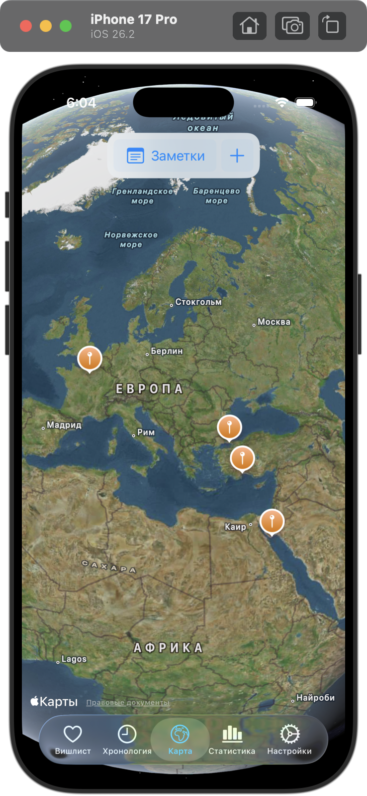
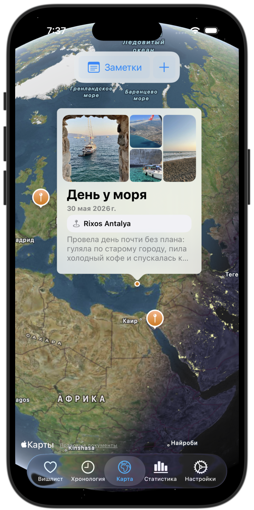
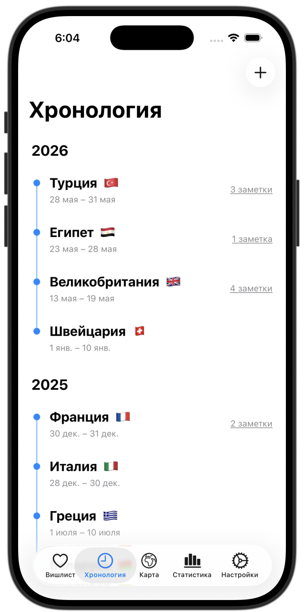
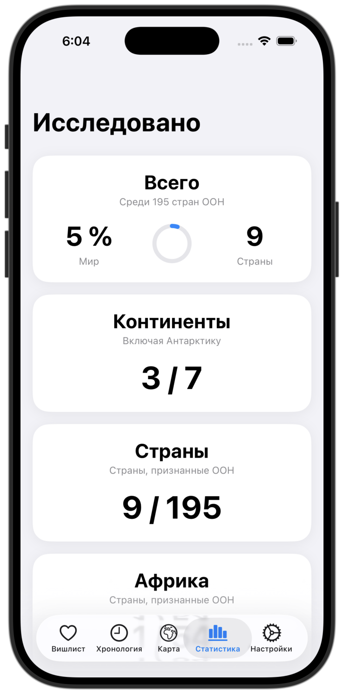
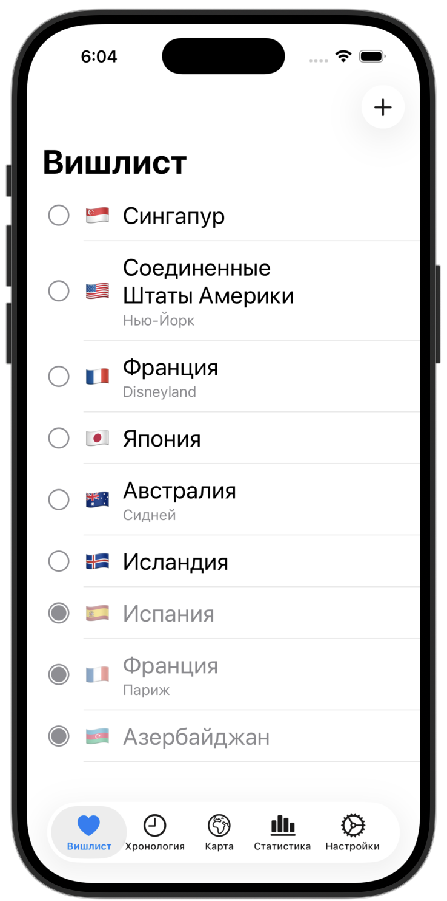
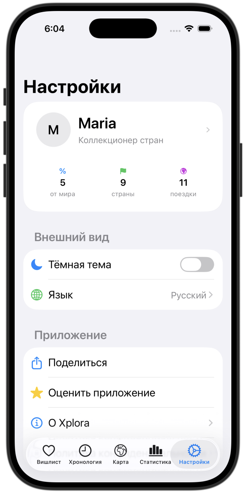
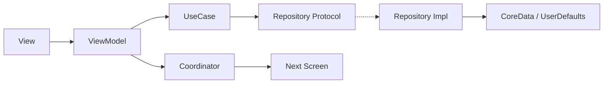

<p align="center">
  
</p>

<h1 align="center">Xplora</h1>
<p align="center"><b>Твой мир, отмеченный на карте.</b></p>

<p align="center">
  
  
  
  
  
</p>

<p align="center">
  
  
  
  
  
  
  
</p>

---

## О проекте

**Xplora** — нативное iOS-приложение для визуализации путешествий: интерактивная карта мира, путевой дневник с фото и геолокацией, хронология поездок, статистика покрытия мира и вишлист направлений. Все данные хранятся локально, без серверной части.

Разработано как курсовой проект на факультете компьютерных наук НИУ ВШЭ (группа БДРИП241) под руководством Коваленко Антона Павловича.

## Возможности

| Модуль | Описание |
|---|---|
| **Карта** | Интерактивная карта мира на MapKit, аннотации заметок, три режима отображения |
| **Дневник** | Заметки с фото, геолокацией и диапазоном дат поездки |
| **Хронология** | Все поездки, сгруппированные по годам, переход к связанным заметкам |
| **Статистика** | Покрытие мира: посещённые страны и континенты |
| **Вишлист** | Список желаемых направлений со статусами «хочу» / «посещено» |

## Архитектура

Clean Architecture + MVVM-C (Coordinator / Builder / Router), внедрение зависимостей через ServiceLocator.



- **Presentation** — View, ViewModel, Coordinator
- **Domain** — Entities, UseCase, Repository Protocols (не зависит от UIKit/CoreData)
- **Data** — Repository Impl, CoreData, UserDefaults, Network, Services

## Стек технологий

- **Язык:** Swift 5
- **UI:** UIKit + SnapKit
- **Карта/геолокация:** MapKit, CoreLocation
- **Медиа:** PhotoKit
- **Хранение:** CoreData (заметки), UserDefaults (остальное)
- **Конкурентность:** async/await, @MainActor
- **DI:** ServiceLocator
- **Тесты:** Swift Testing
- **Локализация:** кастомный `L10n` enum

## Структура проекта
```
Xplora/
├─ App/                 # Точка входа, координатор приложения
├─ Core/
│  └─ DI/               # ServiceLocator
├─ Domain/               # Entities, UseCase, Repository Protocols
├─ Data/
│  ├─ Network/
│  ├─ Persistence/       # CoreData stack, мапперы
│  ├─ RepositoriesImpl/
│  └─ Services/
└─ Presentation/         # Экраны: Map, Diary, Timeline, Stats, Wishlist, Settings
```

## Установка и запуск

```bash
git clone https://github.com/<username>/xplora.git
cd xplora
open Xplora.xcodeproj
```

Требования: Xcode 16+, iOS 18+, зависимости через SPM (устанавливаются автоматически).

## Тестирование

Юнит-тесты написаны на **Swift Testing** и покрывают UseCase-сценарии домена.

```bash
xcodebuild test -scheme Xplora -destination 'platform=iOS Simulator,name=iPhone 16'
```

## Известные ограничения

Проект открыто документирует технический долг в [`TECH_DEBT.md`](./TECH_DEBT.md) — среди прочего, два нарушения границ слоёв (`ProfileViewModel`, `NoteViewModel`) и неполная локализация модулей Note и Map.

## Автор

Валентина Бальде — НИУ ВШЭ, ФКН
