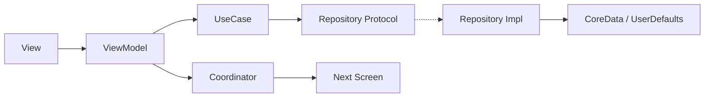

<p align="center">
  
</p>

<h1 align="center">Xplora</h1>
<p align="center"><b>Твой мир, отмеченный на карте.</b></p>

<p align="center">
  
  
  
  
  
</p>

<p align="center">
  
  
  
  
  
  
  
</p>

---

## Содержание

- [О проекте](#о-проекте)
- [Возможности](#возможности)
- [Архитектура](#архитектура)
- [Стек технологий](#стек-технологий)
- [Структура проекта](#структура-проекта)
- [Установка и запуск](#установка-и-запуск)
- [Тестирование](#тестирование)
- [Известные ограничения](#известные-ограничения)
- [Автор](#автор)

---

## О проекте

**Xplora** — нативное iOS-приложение для визуализации путешествий: интерактивная карта мира, путевой дневник с фото и геолокацией, хронология поездок, статистика покрытия мира и вишлист направлений. Пользовательские данные хранятся локально на устройстве; собственного бэкенда у приложения нет, но для каталога стран и городов используется внешний открытый API (CountriesNow), поэтому часть функций требует подключения к интернету.

Разработано как курсовой проект на факультете компьютерных наук НИУ ВШЭ (группа БДРИП241) под руководством Коваленко Антона Павловича.

---

## Возможности

| Модуль | Описание |
|---|---|
| **Онбординг** | Настройка профиля при первом запуске: имя, страна проживания или отметка «гражданин мира» |
| **Карта** | Интерактивная карта мира на MapKit, аннотации заметок с превью и переходом к записи |
| **Дневник** | Заметки с фото, геолокацией и диапазоном дат поездки |
| **Хронология** | Все поездки, сгруппированные по годам, переход к связанным заметкам |
| **Статистика** | Покрытие мира: посещённые страны и континенты |
| **Вишлист** | Список желаемых направлений со статусами «хочу» / «посещено» |
| **Профиль** | Имя, аватар, страна проживания, тема оформления, язык интерфейса, политика конфиденциальности, удаление данных |

---

## Архитектура

Clean Architecture + MVVM-C (Coordinator / Builder / Router), внедрение зависимостей через ServiceLocator.



- **Presentation** — View, ViewModel, Coordinator
- **Domain** — Entities, UseCase, Repository Protocols (не зависит от UIKit/CoreData)
- **Data** — Repository Impl, CoreData, UserDefaults, Network, Services

---

## Стек технологий

- **Язык:** Swift 5
- **UI:** UIKit + SnapKit
- **Карта/геолокация:** MapKit, CoreLocation
- **Медиа:** PhotosUI (`PHPickerViewController`), `UIImagePickerController` для камеры
- **Хранение:** CoreData (заметки), UserDefaults (остальное)
- **Сеть:** URLSession, CountriesNow API (каталог стран и городов)
- **Конкурентность:** async/await, @MainActor
- **DI:** ServiceLocator
- **Тесты:** Swift Testing (юнит), XCTest (UI)
- **Локализация:** `.strings` (ru/en) + SwiftGen — генерирует типобезопасный `L10n` enum

---

## Структура проекта
```
Xplora/
├─ App/                 # Точка входа, координатор приложения
├─ Core/
│  └─ DI/               # ServiceLocator
├─ Domain/               # Entities, UseCase, Repository Protocols
├─ Data/
│  ├─ Network/
│  ├─ Persistence/       # CoreData stack, мапперы
│  ├─ RepositoriesImpl/
│  └─ Services/
└─ Presentation/         # Экраны: Onboarding, Map, Note, Timeline, Statistics, Wishlist, Profile, Legal
                         # + общие модули: TabBar, Shared, Components
```

---

## Установка и запуск

```bash
git clone https://github.com/veckkkl/Xplora.git
cd Xplora
open Xplora.xcodeproj
```

Требования: Xcode 16+, iOS 18+, зависимости через SPM (устанавливаются автоматически).

---

## Тестирование

Юнит-тесты (`XploraTests`) написаны на **Swift Testing** и покрывают use cases, репозитории и часть view model. UI-тесты (`XploraUITests`) на XCTest проверяют запуск приложения.

```bash
xcodebuild test -scheme Xplora -destination 'platform=iOS Simulator,name=iPhone 16'
```

Если Xcode не подхватывает схему `Xplora` автоматически, откройте проект в Xcode и запустите тесты один раз через `Product ▸ Test` — схема создастся сама.

---

## Известные ограничения

- `NoteViewModel` частично нарушает границы Clean Architecture: напрямую работает с `UIKit` (`UIImage`) и `FileManager` вместо того, чтобы делегировать это сервису в Data-слое;
- в `Info.plist` не хватает `NSCameraUsageDescription` — при попытке съёмки фото в заметке на реальном устройстве приложение крашится (в симуляторе не проявляется, так как камера недоступна).

---

## Автор

Валентина Бальде — НИУ ВШЭ, ФКН

Telegram: [@veckkkl](https://t.me/veckkkl) · Email: [vbalde145@gmail.com](mailto:vbalde145@gmail.com)
